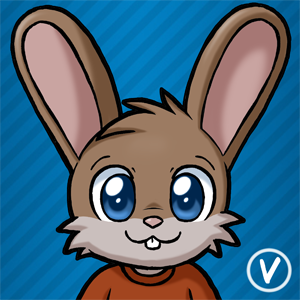
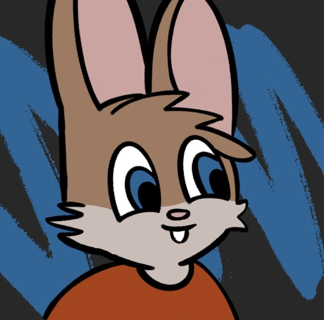
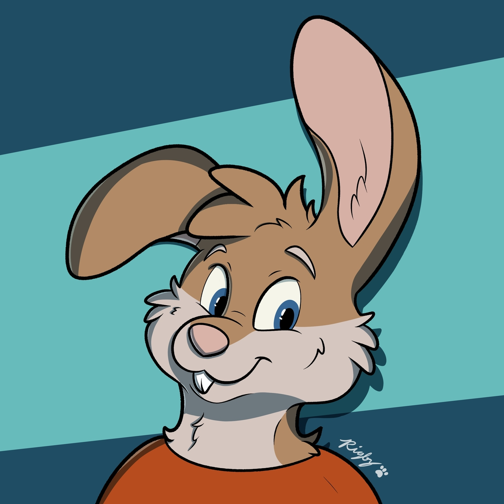
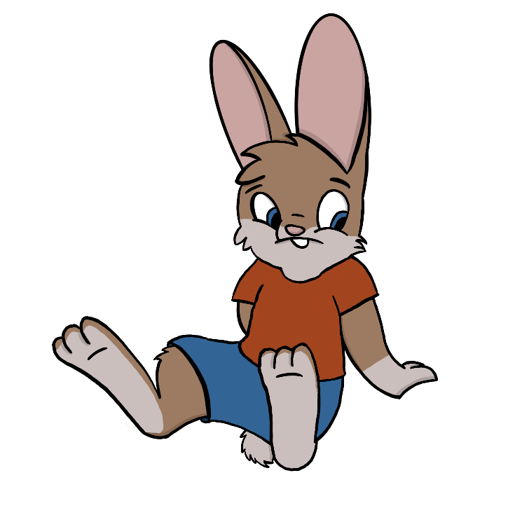
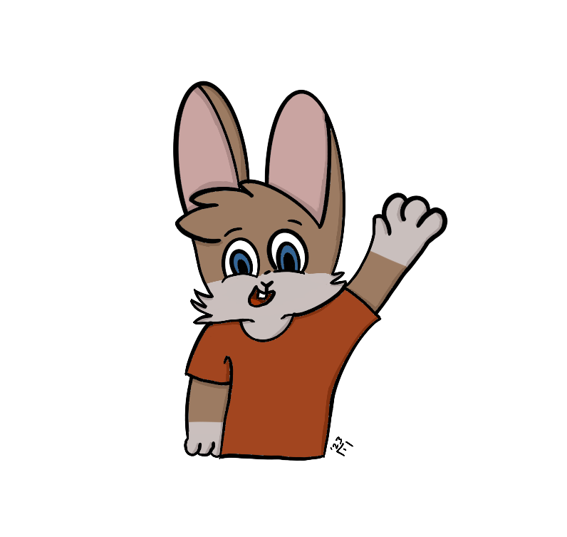
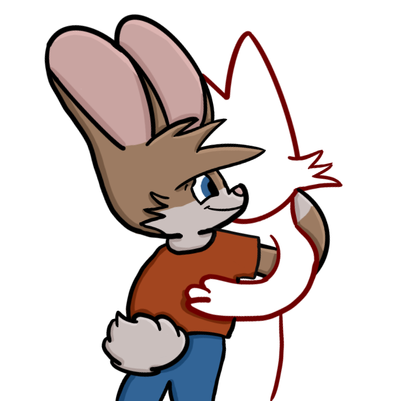
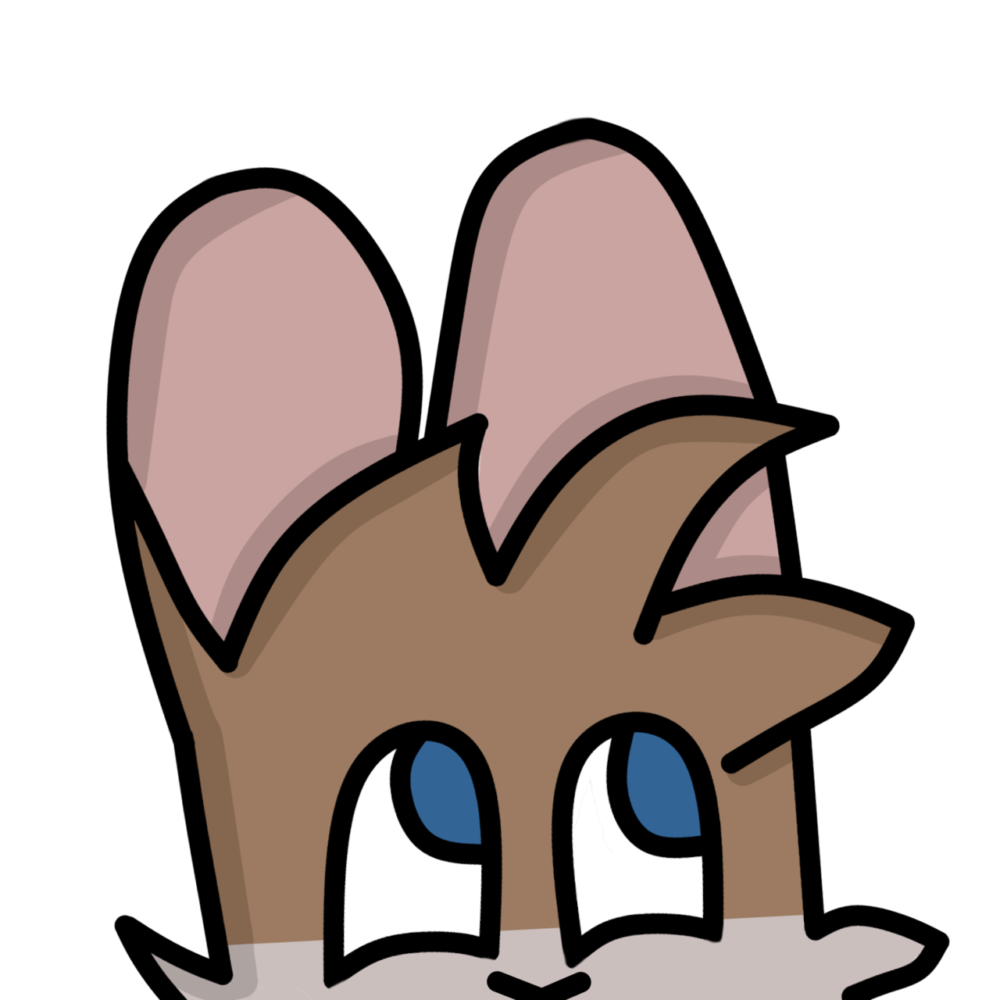
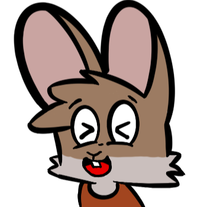

# Vylpes
| Species     | Rabbit  |
| ----------- | ------- |
| Gender      | Male    |
| Pronouns    | He/Him  |
| Height      | 130cm   |

## Colours

    
Fur (Primary) - #a2795e

    
Fur (Secondary) - #ccbfbd

    
Eyes and Shorts - #16537f

    
Shirt - #af3d0b

    
Ears - #d0a2a0

## About
Vylpes the Rabbit is a playful rabbit who loves to make friends with people and
to spread joy to everyone around him. His big fluffy ears and bright blue eyes
capture the hearts of many.

### Apperance
Vylpes has rich, chocolate-brown fur complemented by a soft fawn-brown belly
with a tuft of fur on the sides of his chin. He loves to wear his red t-shirt
with his comfy blue shorts.

### Personality
He's a shy rabbit who tries to put his all into everything he does. He can be
quite adventurous and loves to discover new things. He tries to be kind to all
and loves to try encourage his friends to put in their all.

## Gallery

    

        
        
    

    

        
        
    

    

        
        
    

    

        
        
    

