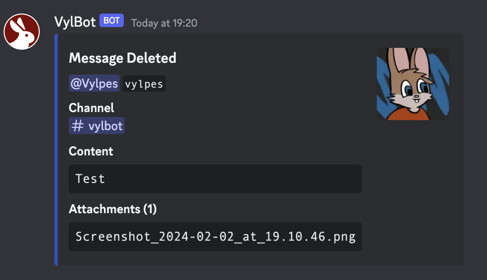

> **08 June 2024**  
> VylBot 3.2.2 has been released, fixing bugs and vulnerabilities. Please update when possible to ensure your security is kept up-to-date.

> **13 March 2024**  
> VylBot 3.2.1 has been released, fixing bugs and vulnerabilities. Please update when possible to ensure your security is kept up-to-date.

This week has seen the release of VylBot 3.2! This has been a while in development as I've been juggling other projects, but am happy to finally have released it!

## Release Notes
Below is the changes in this release:

### Server Access Button
This is a new command which allows moderators to generate a "Verify" button which will allow users to gain the server access role, as an alternative to the access code functionality already present.

This is generated using the new `/rules access` subcommand, previous rules functionality has been moved to `/rules embeds`

The label text can be changed using the `rules.access.label` config key. The verification role is set in `verification.role` config key, as used by the access code function.

> **KNOWN ISSUE:** I am aware that the help text for the configuration doesn't include `rules.access.label`, this will be resolved in a future release

### Attachments On Moderation Embeds
The embeds used for message actions such as delete and edit have had their attachment field changed. The previous logic would give you a link to the image but this has changed to just show the file names as a list, this is due a discord CDN privacy feature where it disappears from the CDN after the message is deleted after cache is refreshed. Not anything I can do on my end about that so have made the embed a bit cleaner.

As a bonus addition the title of the field includes a sum of attachments

### Bug Fixes
- Fixed event embeds not containing the user's avatar in the thumbnail of the embed
- Fixed the config command not showing the config name properly
- Fixed the config command not showing the config value when the key doesn't exist
- Fixed the nickname update event not firing
- Fixed typo on the config list describing the wrong config type

## Contributing
VylBot is an open source project, although mostly for my own server it is open for anyone else to use and contribute to, happy for anyone to contribute!

- [Ko-Fi](https://ko-fi.com/vylpes)
- [Gitea](https://gitea.vylpes.xyz/RabbitLabs/vylbot-app) / [GitHub](https://github.com/vylpes/vylbot-app) / [Codeberg](https://codeberg.org/Vylpes/vylbot-app)
- [Discord](https://go.vylpes.xyz/A6HcA)
- [Twitter](https://twitter.com/vylpes)