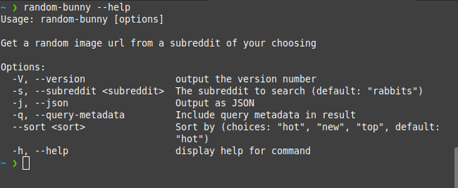
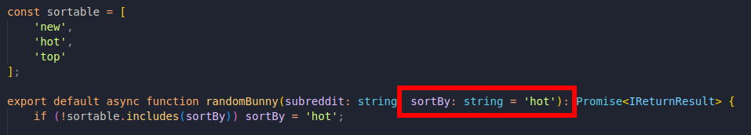
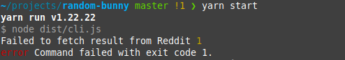

Random Bunny 2.2 has been released and is available to install via npm! This update has the notable change of a CLI! See below for the full change log.

## Release Notes

Below is the changes in this release:

### Command Line Interface

Starting with this release we now feature a a CLI binary! This will be kept in feature parity with the usual npm installer and will be published with the git releases page.

> **KNOWN ISSUE:** I am aware that the macOS Arm build is broken, will look into fixing this. For now you can use the x86 build under Rosetta

### Sort By variable default

The "sortBy" parameter now gets defaulted if you don't supply one. This is useful so you don't need to always specify one.

This will default to "hot".

### Friendly user error messages

The bot will also now produce a more friendly message if the code is unable to fetch an image from reddit, rather than cause an exception.

## Contributing
Random Bunny is an open source project, although mostly for my own usage it is open for anyone else to use and contribute to, happy for anyone to contribute!

- [Ko-Fi](https://ko-fi.com/vylpes)
- [Forgejo](https://git.vylpes.xyz/RabbitLabs/random-bunny) / [GitHub](https://github.com/vylpes/random-bunny) / [Codeberg](https://codeberg.org/Vylpes/random-bunny)
- [Discord](https://go.vylpes.xyz/A6HcA)