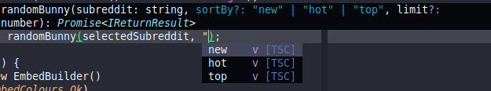
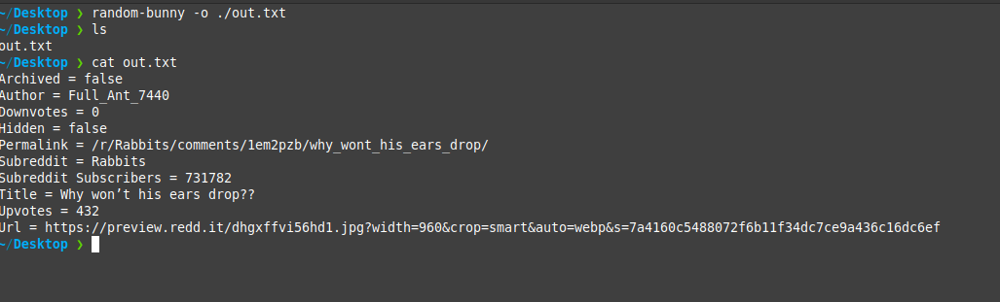
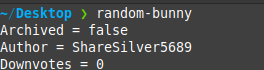

Random Bunny 2.3 has been released and is available to install via npm! This
update is a smaller update but contains the following:

## Release Notes

### SortBy Variable Types

For the TypeScript users, the `sortBy` variable now contains a string type that
defines what the string can be, useful to know without checking documentation.

### CLI Output To File Option

The CLI now has the ability to output to a file. This can be done with the `-o`
flag.

### Author Option

The output now contains the post author.

### Limit API call to reddit

You can now limit the amount of posts the Reddit API will return.

This can be any number between 1 and 100. The default is 100.

You shouldn't have to supply this but can be useful if needed. Please note that
limiting the amount returned to the script might create a higher chance that
the script won't find a valid image post.

## Contributing
Random Bunny is an open source project, although mostly for my own usage it is open for anyone else to use and contribute to, happy for anyone to contribute!

- [Ko-Fi](https://ko-fi.com/vylpes)
- [Forgejo](https://git.vylpes.xyz/RabbitLabs/random-bunny) / [GitHub](https://github.com/vylpes/random-bunny) / [Codeberg](https://codeberg.org/Vylpes/random-bunny)
- [Discord](https://go.vylpes.xyz/A6HcA)