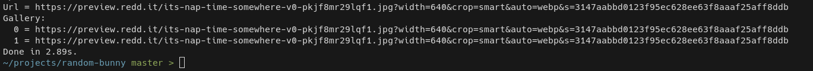

Random Bunny 2.4 has now been released and includes the following changes:

> **macOS build support has been removed:** Unfortunately because I no longer
able to reproduce mac testing, I have removed it from the binaries that I package
alongside the releases. You can still use the package on a mac, but I won't be
supplying a pre-built binary for macOS anymore.

## Release Notes

### Gallery Images
The output now includes a gallery array for posts which contain more than one
image:

This of course works with the JSON flag as well.

### -q And --json Fixed
The previous issue where you couldn't use the `-q` and `--json` flags together
and have the query metadata shown has been fixed.

### URL is undefined Fixed
The issue in the previous releases where the URL field was `undefined` a lot of
the time has now been fixed.

## Contributing
Random Bunny is an open source project, although mostly for my own usage it is
open for anyone else to use and contribute to, happy for anyone to contribute!

- [Ko-Fi](https://ko-fi.com/vylpes)
- [Forgejo](https://git.vylpes.xyz/RabbitLabs/random-bunny) / [GitHub](https://github.com/vylpes/random-bunny)
- [Discord](https://discord.gg/UyAhAVp)